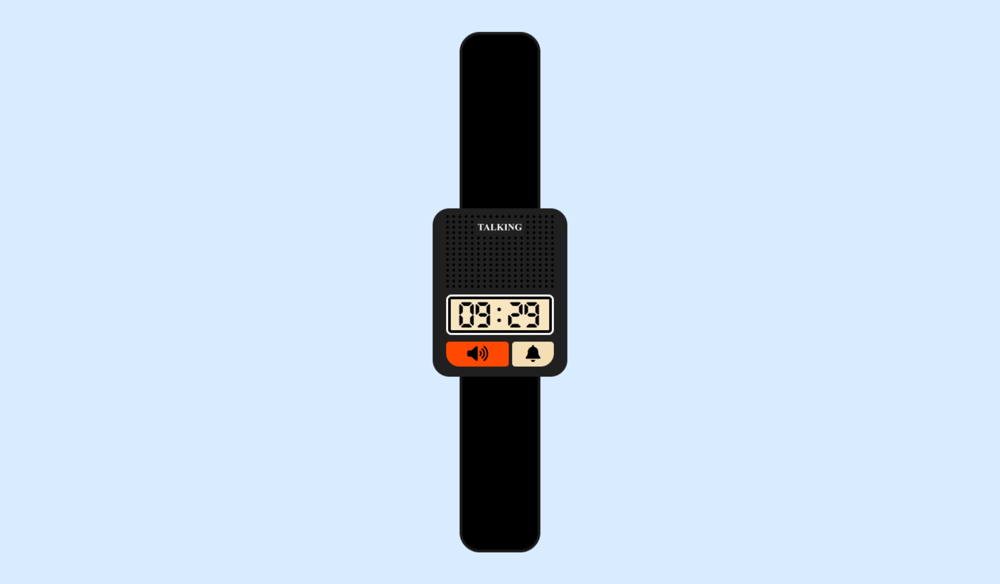

# App Relógio Falante

## Sobre o projeto

Um clone de digital de um relógio que fala as horas, muito comum no final da década de 90 e inicio de 2000.

## Como utilizar

Basta digitar no botão falar as horas (botão de cor laranja).

## Informações

Projeto desenvolvido utilizando apenas HTML, CSS e JavaScript. As vozes foram feitas com Inteligencia Artificial utilizando o <a href="https://elevenlabs.io/">ElevenLabs<a>.

## Demonstração

https://app-talking-clock.vercel.app/

